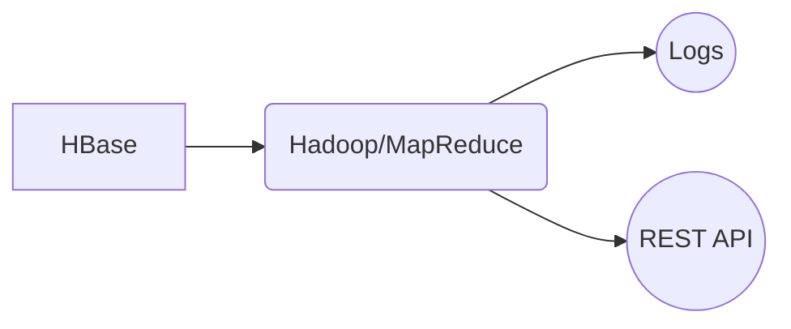

# Welcome to bigdataproj!

This a little project of Master's degree at Tours University for Big Data, Cloud Computing et Services Web class. A project to practice and learn hbase manipulation, hadoop, mapreduce and REST

Members:
*Akachi, Ines
Nascimento Filho, Jessé Ferreira*

To execute this project on your own environment make sure that you have installed and setting:

 - Java SDK 1.8;
 - Hadoop;
 - HBase;
 - MapReduce;
 - Eclipse+m2e;

Our environment is a VM CentOS of Univ-Tours, thus the access to it is restricted to members of university. 

# How to:

**Load HBase:**  
$ `java -cp  'hbase classpath' :bigdataproj.jar:load_lib/* bdma.bigdata.aiwsbu.data.Setup`

load_lib/ is a directory with all dependecies of [hadoop](https://mvnrepository.com/artifact/org.apache.hadoop), [HBase](https://mvnrepository.com/search?q=HBase%20) and [javafaker](https://mvnrepository.com/artifact/com.github.javafaker/javafaker).

## Architecture

You can render UML diagrams using [Mermaid](https://mermaidjs.github.io/).

References
-
https://hostpresto.com/community/tutorials/how-to-install-apache-hadoop-on-a-single-node-on-centos-7/
http://linuxpitstop.com/configure-distributed-hbase-cluster-on-centos-linux-7/
https://www.tutorialspoint.com/hbase/hbase_installation.htm
https://www.youtube.com/watch?v=bYaxXIRakxM
https://mvnrepository.com/
https://stackedit.io/

